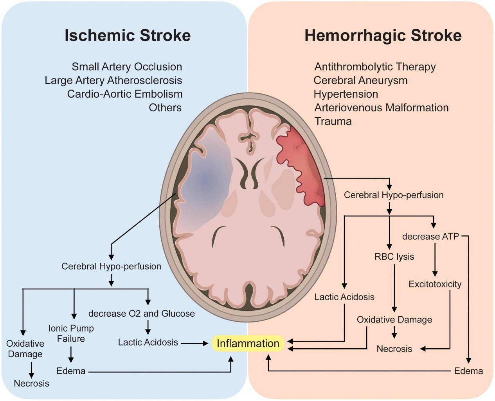

**[art.1] Stroke (Part 1)**
============================

*English report, 2nd sem. of third grade in NTUMED*

**1-0. Introduction**
----------------------

Stroke is the 2\ :sup:`nd`\  leading cause of death and a major contributor to disability worldwide.
Initially considered solely a vascular condition, it was ultimately reclassified as a neurological 
disease in the International Classification of Disease 11 (ICD-11) following extensive research and 
advocacy by clinicians. The reclassification has facilitated more precise data documentation and 
statistical analysis, thereby supporting advancements in acute healthcare and the allocation of 
research funding for stroke. Initially considered solely a vascular condition, it was ultimately 
reclassified as a neurological disease in the International Classification of Disease 11 (ICD-11) 
following extensive research and advocacy by clinicians. The reclassification has facilitated more 
precise data documentation and statistical analysis, thereby supporting advancements in acute healthcare 
and the allocation of research funding for stroke.

**1-1. Types and Etiology**
---------------------------

Strokes can be classified into two main categories: ischemic stroke and hemorrhagic stroke, 
where ischemic stroke is more commonly seen.

Ischemic stroke
~~~~~~~~~~~~~~~~~~

Ischemic strokes, accounting for about 80-85% of all strokes, result from the blockage of an 
artery or vein that impairs blood flow to part of the brain, causing brain cells and tissues 
to die from lack of oxygen and nutrients.

Ischemic strokes are further divided into 2 groups:

1. **Thrombotic stroke**. Caused by a blood clot that develops in the arteries supplying 
blood to the brain, thrombotic stroke may occur suddenly or gradually over a period of hours 
or days. This type of stroke is commonly seen in older persons with high cholesterol, 
atherosclerosis, or diabetes, and may be preceded by transient ischemic attacks (TIAs) that have 
similar symptoms to a stroke. Lacunar infarctions, which occur in small blood vessels in the brain, 
are also a type of thrombotic stroke.

2. **Embolic stroke**. Resulting from a blood clot (embolus) that forms elsewhere in the body 
and travels through the bloodstream to the brain, embolic stroke often occurs rapidly and 
without warning signs. These strokes are commonly associated with heart disease or heart 
surgery, with about 15% occurring in people with atrial fibrillation, an abnormal heart rhythm.

Hemorrhagic Stroke
~~~~~~~~~~~~~~~~~~~

Hemorrhagic strokes, which make up approximately 15% of all strokes, occur when a blood vessel 
supplying the brain ruptures and bleeds, causing pressure to build up in surrounding tissues, leading 
to brain damage.

Hemorrhagic strokes are divided into 2 main categories:

1.	**Intracerebral hemorrhage**. A sudden and rapid bleeding in the brain usually caused by 
high blood pressure. This type of hemorrhage can be severe enough to lead to coma or even death 
without any warning signs.

2.	**Subarachnoid hemorrhage**. It occurs when bleeding happens between the brain and the meninges. 
It is often caused by an aneurysm or an arteriovenous malformation (AVM), and can also result from trauma. 
Aneurysms are weakened, ballooned areas on an artery wall that may be present at birth or develop later 
in life due to factors such as high blood pressure or atherosclerosis. AVM is a congenital disorder 
characterized by a tangled web of arteries and veins, which may be genetic or related to certain syndromes.

Transient ischemic attack (TIA)
~~~~~~~~~~~~~~~~~~~~~~~~~~~~~~~~~~~

TIA is sometimes not classified under these two types. It is a temporary interruption of blood flow 
to the brain, causing stroke-like symptoms that typically last less than 24 hours, which can be viewed 
as an alarm before real stroke occurrence.

**1-2. Pathophysiology**
------------------------

When cells in the brain are injured, molecules such as DNA can leak into the extracellular environment, 
causing changes in expression and structure that lead to complex secondary pathophysiological processes. 
Stroke pathophysiology involves a range of cascade processes, including:
 
+------------------------------------------------+---------------------------------------------+
| Loss of cellular homeostasis                   | Complement activation                       |
+------------------------------------------------+---------------------------------------------+
| Energy failure                                 | Apoptosis                                   |
+------------------------------------------------+---------------------------------------------+
| Metabolic acidosis                             | Autophagy                                   |
+------------------------------------------------+---------------------------------------------+
| Increased intracellular Ca\ :sup:`2+`\  levels | Disruption of the blood brain barrier (BBB) |
+------------------------------------------------+---------------------------------------------+
| Free radical mediated toxicity                 | Activation of glial cells                   |
+------------------------------------------------+---------------------------------------------+
| Generation of arachidonic acid products        | Infiltration of leukocytes                  |
+------------------------------------------------+---------------------------------------------+
| Cytokine mediated cytotoxicity                 |                                             |
+------------------------------------------------+---------------------------------------------+

In both ischemic and hemorrhagic stroke, significant cerebral hypoperfusion leads to increased 
anaerobic metabolism, lactic acidosis, astrocyte demise, and an increase in neuroinflammatory 
cytokines. [**Figure 1**]

The pathophysiology of ischemic stroke
~~~~~~~~~~~~~~~~~~~~~~~~~~~~~~~~~~~~~~~

Varies depending on its underlying cause, which can be categorized as focal or global ischemic stroke 
based on the area of the brain affected. Brain tissue is highly sensitive to even mild changes in oxygen 
levels, and hypoxia for several minutes can lead to irreversible injury. Cerebral auto regulation helps 
maintain brain perfusion pressure, but prolonged ischemia can decrease oxygen delivery and lead to 
anaerobic glycolysis, free radical production, cell membrane and DNA damage, and ultimately cell death.

The pathophysiology of hemorrhagic stroke
~~~~~~~~~~~~~~~~~~~~~~~~~~~~~~~~~~~~~~~~~~~~~

A hemorrhagic stroke occurs when a blood vessel in the brain ruptures, interrupting blood supply and 
causing blood to irritate brain tissue and disrupt its delicate chemical balance. This can lead to increased 
intracranial pressure, impeding blood flow and making hemorrhagic strokes more dangerous than ischemic strokes. 
The two types of hemorrhagic stroke are intracerebral hemorrhage and subarachnoid hemorrhage, and amphetamine 
and cocaine abuse can significantly increase the risk.

  **Figure 1**. The pathophysiology and mechanisms underlying ischemic and hemorrhagic strokes share 
  a common pathway of cerebral hypoperfusion, leading to oxygen deprivation and subsequent anaerobic 
  metabolism. This causes an increase in lactic acidosis, leading to astrocyte death, an increase in 
  neuroinflammatory cytokines, and ultimately neuroinflammation. In addition, cerebral hypoperfusion 
  can cause malfunction of the ionic pump, resulting in potassium efflux, and sodium and calcium influx 
  into the neurons, leading to ATP depletion, excitotoxicity, edema, and eventual necrosis. Furthermore, 
  red blood cell lysis can contribute to oxidative damage and exacerbate necrosis.

**1-3. Summary**
----------------

.. image:: ../_static/stroke_comparison_table.png
   :width: 600 px
   :align: center
   :alt: ischemic and hemorrhagic stroke comparison table

**1-4. References**
-------------------

-	Kuriakose D, Xiao Z. Pathophysiology and Treatment of Stroke: Present Status and Future Perspectives. Int J Mol Sci. 2020 Oct 15;21(20):7609. doi: 10.3390/ijms21207609. PMID: 33076218; PMCID: PMC7589849.
-	Purves D, Augustine GJ, Fitzpatrick D, et al., editors. Neuroscience. 2nd edition. Sunderland (MA): Sinauer Associates; 2001. The Blood Supply of the Brain and Spinal Cord. Available from: https://www.ncbi.nlm.nih.gov/books/NBK11042/
-	Woodruff, T.M., Thundyil, J., Tang, SC. et al. Pathophysiology, treatment, and animal and cellular models of human ischemic stroke. Mol Neurodegeneration 6, 11 (2011). https://doi.org/10.1186/1750-1326-6-11
-	Shakir, R. (2018). The struggle for stroke reclassification. Nature Reviews Neurology, 14(8), 447-448. doi: 10.1038/s41582-018-0036-5.
-	Donnan, G. A., Fisher, M., Macleod, M., & Davis, S. M. (2008). Stroke. The Lancet, 371(9624), 1612-1623. https://doi.org/10.1016/S0140-6736(08)60694-7
-	Feigin, V. L., Lawes, C. M., Bennett, D. A., & Anderson, C. S. (2003). Stroke epidemiology: A review of population-based studies of incidence, prevalence, and case-fatality in the late 20th century. The Lancet Neurology, 2(1), 43-53. https://doi.org/10.1016/S1474-4422(03)00266-7
-	Taipei Medical University, Taipei Neurological Institute. (2023). 腦中風有幾種？要看哪一科呢？Retrieved from https://reurl.cc/ykzloq
-	Global Burden of Disease Study 2016 Collaborators. (2019). Global, regional, and national burden of stroke, 1990-2016: A systematic analysis for the Global Burden of Disease Study 2016. Lancet Neurology, 18(5), 439-458. doi: 10.1016/S1474-4422(19)30034-1.
-	Kelly-Hayes, M. (2010). Influence of age and health behaviors on stroke risk: Lessons from longitudinal studies. Journal of the American Geriatrics Society, 58(Suppl 2), S325-S328. doi: 10.1111/j.1532-5415.2010.02915.x.
-	Boehme, A. K., Esenwa, C., & Elkind, M. S. (2017). Stroke risk factors, genetics, and prevention. Circulation Research, 120(3), 472-495. doi: 10.1161/CIRCRESAHA.116.308398.
-	Hopkins Medicine. (n.d.). Types of Stroke. Retrieved from https://www.hopkinsmedicine.org/health/conditions-and-diseases/stroke/types-of-stroke
-	Sec. Translational Neuroscience. (2022, October 13). REVIEW article. Frontiers in Neuroscience, 16, Article 981726. https://doi.org/10.3389/fnins.2022.981726
-	Woodruff, T.M., Thundyil, J., Tang, SC. et al. Pathophysiology, treatment, and animal and cellular models of human ischemic stroke. Mol Neurodegeneration 6, 11 (2011). https://doi.org/10.1186/1750-1326-6-11
-	Gibson, C.M., Hadipour, M., & Anwar, A. (n.d.). Ischemic Stroke Pathophysiology. In Wikidoc. Retrieved May 12, 2023, from https://www.wikidoc.org/index.php/Ischemic_stroke_pathophysiology
-	Gibson, C.M. & Mehrsefat, S. (n.d.). Hemorrhagic stroke pathophysiology. In Wikidoc. Retrieved May 12, 2023, from https://www.wikidoc.org/index.php/Hemorrhagic_stroke_pathophysiology

